# Threading, Concurrency and Parallelism

## Background

### What is threading? 

Threads are the smallest unit of execution that can be scheduled inside a process. When a thread is spawned, it shares the spawning process’s code section, environment variables, and virtual address space. Each thread has its own user and kernel stack, and the information that is required for the scheduler to context switch between threads.
Two major benefits of threading are that it allows multiple programs to run on the same CPU, such as an operating system's desktop GUI and concurrently running applications, and it allows a single program to distribute its computation across the available compute resources. Modern CPUs, from low-power mobile CPUs in PEDs to high-performance server CPUs, are designed to execute threads concurrently. Simultaneous multithreading (SMT) allows the CPU to issue instructions from multiple threads simultaneously, keeping hardware utilization high in the system. When utilized correctly, threading can facilitate the parallel execution of certain tasks within a process, with tasks being able to be spread across multiple threads that can be executed concurrently on multiple CPU cores.

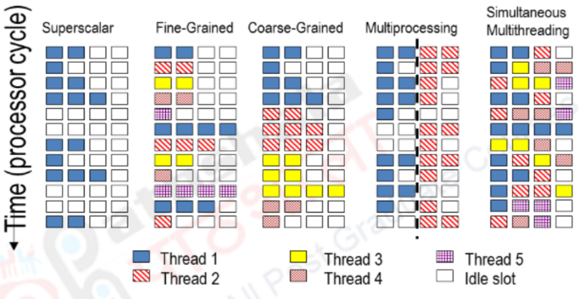

### Scheduling

In order for threads to perform well, the algorithm used to schedule the threads must be efficient. There are many scheduling strategies that could be used, such as Round Robin, First Come First Serve, Shortest Job First, etc. These strategies impact the latency of a computation and introduce additional overhead into thread management. When a thread is switched, its context must be saved, the scheduler data structure is updated, and the new context is loaded. This is typically handled by the kernel; thread scheduling within a user process is also possible. Context switching not only imparts latency due to needing to load hardware registers in the CPU, but it can also decrease the speculative performance of the CPU by modifying the microarchitectural state with another process’s data.


## Parallelism 

In order for a problem to be parallelized, the tasks that make up the problem must be independent. This means that tasks do not require the results from previous stages of the computation. These independent stages can then be run concurrently, with sequential operations performed at the end in order to produce the final computation result. In the image below, the top algorithm is made up of 5 tasks that are not dependent on each other, and can therefore be executed independently. The output of these tasks is stopped at a barrier, which waits for the results from the tasks before executing the sequential code in the end block to reassemble the results. The bottom half of the image shows a process that is not parallelizable, as each of the tasks has sequential dependencies.

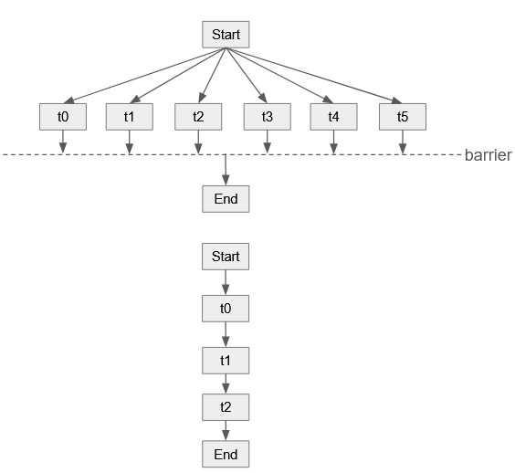

Problems that contain many independent tasks are known as embarrassingly parallel. They include Monte Carlo methods, image rendering, and numerical integration. These problems consist of a large number of independent tasks that can be computed in parallel, reducing the execution time. On the other side of the spectrum are the class of problems known as P-complete. These problems are a series of mostly dependent tasks, such as Newton’s root finding method, and finding the output of a digital circuit.


## Sequential RAM Model

Traditionally, algorithms have been analyzed using the **Random Access Machine (RAM) model**. The RAM model assumes a single processor executing one instruction at a time with access to unbounded memory. Each instruction is assumed to take constant time including arithmetic operations, logical operations, branching, and memory accesses.

Under this model, the runtime of an algorithm is measured as the total number of executed instructions. This forms the basis for asymptotic complexity analysis using Big-O notation.

The RAM model is helpful for analyzing sequential algorithms because it gives a simple way to think about computation and matches how languages like C and C++ work.

### Example: Sequential Array Sum

```cpp
int sum = 0;

for (int i = 0; i < n; i++) {
    sum += arr[i];
}
```

Under the RAM model:
- Each loop iteration performs a constant amount of work
- The loop executes n times
- Total runtime is therefore:

**Runtime:** $T(n) = O(n)$

This analysis correctly describes how the algorithm scales asymptotically on a single processor.

---

### Limitations of the RAM Model

While the RAM model is effective for analyzing sequential algorithms, it fails to account for the realities of parallel execution.

The RAM model does not capture:
- Dependencies between computations
- Available concurrency
- Synchronization constraints
- Critical paths that limit scalability

Most importantly, asymptotic runtime alone does **not** determine whether an algorithm parallelizes effectively.

For example, two algorithms may both have runtime $O(n)$, yet have completely different parallel scalability characteristics.

#### Example 1: Embarrassingly Parallel

```cpp
for (int i = 0; i < n; i++) {
    output[i] = input[i] * 2;
}
```

Here each iteration is independent and can run in parallel.

---

#### Example 2: Sequential Dependency

```cpp
for (int i = 1; i < n; i++) {
    prefix[i] = prefix[i - 1] + arr[i];
}
```

In this case, each step depends on the previous one so parallelism is limited even though the complexity is still $O(n)$.

This demonstrates an important principle in parallel computing:

> Big-O complexity does not imply parallel scalability.

To understand parallel execution, we need to show how different parts of a computation depend on each other. That's why we use the DAG (Directed Acyclic Graph) model.

## DAG Model of Computation

To reason about parallel execution, we model a computation as a **Directed Acyclic Graph (DAG)**.

In a DAG:
- Each node is a step of computation
- Each edge shows that one step must finish before the next can start
- If there’s an edge from node **u** to node **v**, then **u** must finish before **v** can run

Unlike the RAM model, the DAG model explicitly exposes:
- dependency structure
- available concurrency
- synchronization constraints
- critical paths

In practice, it's too much work to make a node for every single instruction. So, we usually group computational sequences of steps into bigger pieces called **strands**.

A DAG typically consists of a single **source** (start) node and a single **sink** (stop) node.

This makes execution structure easier to visualize and analyze.

### Example

```cpp
double a = f();
double b = g();

double c = h(a, b);
double d = p(a);

double e = q(c, d);
```

Dependency structure:
- `f()` and `g()` are independent
- `h(a,b)` depends on both `f()` and `g()`
- `p(a)` depends only on `f()`
- `q(c,d)` depends on both previous results

This exposes available parallelism:
- `f()` and `g()` can run concurrently
- `p(a)` can begin as soon as `f()` finishes
- synchronization occurs at `h(a,b)` and `q(c,d)`

<br>
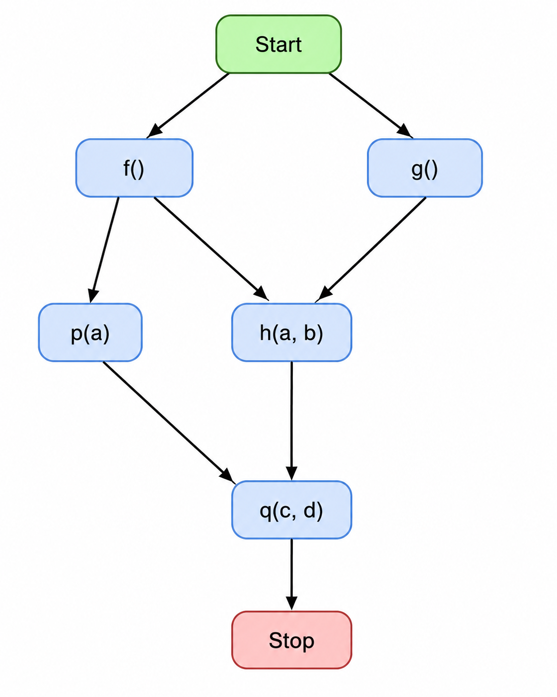

> Any nodes in the DAG that do not have a dependency path between them can be executed in parallel.

## Work and Span

The DAG lets us measure:
- total work
- longest dependency chain
- potential for parallel speedup

The two most important metrics are:
- **Work**
- **Span**

These form the foundation of modern parallel algorithm analysis. 

### Work

The **work** of a computation, denoted $W(n)$, is the total cost of all nodes in the DAG.


$W(n) = T_1$

This is equivalent to:
- total computation performed across all tasks
- runtime on one processor

Work is the baseline cost of the problem, independent of how many processors you use. A strong parallel algorithm should remain **work-efficient**, meaning its total work stays asymptotically close to the best sequential solution and avoids unnecessary overhead from excessive task creation or synchronization.

---

### Span

The **span** (also called depth or critical path) denoted $D(n)$, is the cost of the longest dependency path in the DAG.

$D(n) = T_{\infty}$

Span represents:
- runtime with infinitely many processors (ignoring overheads)
- a lower bound on parallel execution time
- the inherently sequential portion of the computation

Span is what ultimately limits scalability since no amount of hardware can eliminate dependency chains on the critical path.

Only operations without dependencies can run at the same time, so dependencies make the critical path longer. This means that just a few long chains of dependent steps can have a big impact on total runtime. To make programs faster, span-based optimizations often focus on cutting down these dependency chains instead of simply doing fewer total steps.

---
## Defining Parallelism

Using work and span, we define the **average available parallelism** of a computation:

$P = \frac{W(n)}{D(n)} = \frac{T_1}{T_\infty}$

This ratio estimates how many processors the algorithm can use profitably and serves as an upper bound on ideal speedup. Higher $P$ means more exploitable concurrency and better scaling potential, while lower $P$ indicates stronger dependency limits and less possible speedup.

---

## Work/Span Examples

### Example 1: Minimal Parallelism

Consider a mostly sequential computation:

```text
Start => A => B => C => D => E => Stop
```

If each node has cost 1:
- Work: $W(n) = 5$
- Span: $D(n) = 5$

$P = \frac{W(n)}{D(n)} = \frac{5}{5} = 1$

This computation has essentially no exploitable parallelism. A value of $P = 1$ means adding processors cannot provide meaningful speedup because every step depends on the previous one.

---

### Example 2: High Parallelism

Now consider a balanced tree-like computation:

```text
          result
         /      \
       t1        t2
      /  \     /    \
    s1   s2   s3    s4
   / \  / \   / \   / \
 a1 a2 a3 a4 a5 a6 a7 a8
      
```

For $n$ inputs:
- Work: $W(n) = O(n)$
- Span: $D(n) = O(\log n)$

$P = \frac{W(n)}{D(n)} = \frac{O(n)}{O(\log n)} = O(n / \log n)$

This has substantially higher scaling potential because many nodes at the same level are independent and can execute concurrently.

The key insight is that parallel performance improves not by increasing total work, but by reducing the span while keeping work efficient.

---
## Reduction as a Work/Span Example

A **reduction** combines many values into one value using an operation such as addition.

### Sequential Reduction

```cpp
int sequential_sum(const std::vector<int>& a) {
    int sum = 0;

    for (int x : a) {
        sum += x;
    }

    return sum;
}
```

This creates a dependency chain:

```text
sum = (((a0 + a1) + a2) + a3) + ...
```

Each addition depends on the previous partial sum.
- $W(n) = O(n)$
- $D(n) = O(n)$


<br>


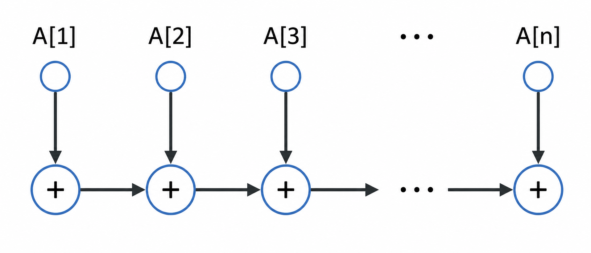

---

### Tree Reduction

Instead of accumulating from left to right, we can combine values in pairs and then combine partial sums:

```cpp
int tree_sum_range(const std::vector<int>& a, int left, int right) {
    if (left == right) {
        return a[left];
    }

    int mid = (left + right) / 2;

    int leftSum = tree_sum_range(a, left, mid);
    int rightSum = tree_sum_range(a, mid + 1, right);

    return leftSum + rightSum;
}

int tree_sum(const std::vector<int>& a) {
    if (a.empty()) {
        return 0;
    }

    return tree_sum_range(a, 0, a.size() - 1);
}
```

This performs roughly the same total number of additions, but the dependency structure becomes a balanced tree.

- Work: $W(n) = O(n)$
- Span: $D(n) = O(\log n)$

<br>
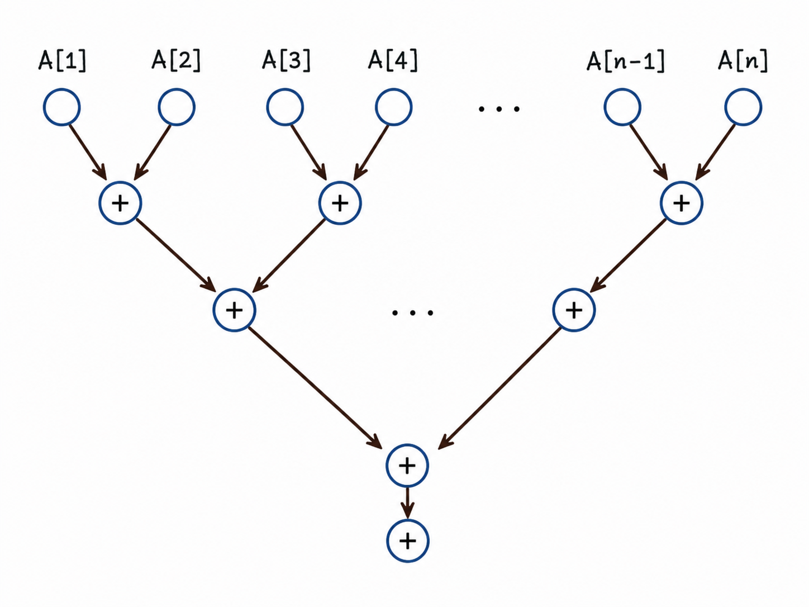
<br>

> Parallel speedup often comes from restructuring dependencies, not from reducing total computation.

---
## Reduction Considerations

Tree reductions are powerful, but they rely on assumptions that are easy to violate in real code.

### Associativity

The combine operation should be **associative**:

$$
(a+b)+c = a+(b+c)
$$

This works well for operations like integer addition, multiplication, minimum, and maximum.

However, floating-point addition is not perfectly associative because of rounding:

```cpp
(a + b) + c != a + (b + c)
```

So floating-point parallel reductions can produce slightly different answers than sequential reductions. This is often acceptable, but it should be treated as a numerical behavior change not a bug in the runtime.

### Side Effects

The combine function for a reduction should not have side effects. It shouldn't change shared data, do I/O, or rely on global state. Since parallel reductions can run in any order, side effects can cause random or inconsistent results. Instead, the combine should be a simple pure operation that gives the same answer no matter the order.

---

### Real-World Limits

Work/span analysis is an idealized model. Real systems add additional costs that are not captured by $T_1$ and $T_\infty$ alone:

- task creation, scheduling, and synchronization overhead
- cache and memory bandwidth limits
- communication and data movement costs between cores
- load imbalance effects

As a result, exposing more parallelism is not sufficient by itself. If tasks are too fine-grained, runtime overhead dominates. If data movement is high, locality degrades and throughput drops.

In real programs, this is handled by tuning task size and measuring performance. Developers usually profile runtime, adjust chunk sizes for better balance, and reduce unnecessary synchronization and data movement. Scheduler behavior and cache locality also matter, so two designs that look similar in theory can perform differently in practice. The practical goal is to add parallel work only when its speedup benefit is larger than its overhead cost.

---

## Pitfalls when Implementing Parallelism


### Data Races

- 3 Conditions
  - 2+ threads in a single process access the same memory location concurrently
  - At least one of the accesses is writing
  - There is no synchronization

Results in **UNDEFINED, NONDETERMINISTIC** behavior - something may go wrong, it may not, harder to debug

#### Example Program

Below, we have example code. At first glance, this code seems to be fine. We are simply adding and subtracting from a variable, and each even seems to be done instantaneously with just the one ++ or -- instruction. However, when we start to run it with multiple threads we start to run into issues. 

> As this is such a trivial progarm, if we compile with -O3 it will actually optimize it to the point that the data race is no longer present. This is an especailly dangerous part of  data races as they can sit hidden until other parts of the program are modified that affects the optimization of the entire program.

```#include <thread>
#include <vector>
#include <iostream>

int cash = 0;   //Shared global variable

void customer() {
    for (int i = 0; i < 100000; ++i) {
        cash++;
        cash--;
    }
}

int main() {
    const int N = 32;

    std::vector<std::thread> threads;

    for (int i = 0; i < N; ++i) {
        threads.emplace_back(customer);
    }

    for (auto &t : threads) {
        t.join();
    }

    std::cout << "Total: " << cash << std::endl;

    return 0;
}
```

As you can see when we run this program various times, without changing anything, we get completely distinct outputs. They can vary between positive adn negative values, and it is even possible for it to be 0 as expected. This is part of what makes data races hard to debug, they create non-reproducible results.


#### Preventing Data Races

##### Synchronization Methods

- Mutexes - mutual exclusion
    - Can lock exclusively or shared to allow for concurrent reads
- Atomics - ensures consistency for that variable without needing explicit locking
- CAS (Compare and Swap)
  - Compares the contents of a memory location with a given value
  - Only if they are the same, modifies the contents of that memory location to a new given value

---

##### Why is `volatile` insufficient?

- Stops compiler from reordering accesses to that `volatile` variable relative to other `volatile` accesses
- Does **not** provide synchronization with non-volatile data

---

## STL Parallelism

As of C++ 17, standard library algorithms accept execution policies (C++ 20 added an additional execution policy and allows ranges to be used). The behavior of these policies is implementation-specific and serve as suggestions, not mandates, to the compiler. The result of using the unsequenced execution policies depends on the SIMD support of the target CPU. The four policies are shown in the table below. In C++ 26, an execution control library is being added, which will allow asynchronous operations and execution schedulers.

| Policy                    | Execution                                                      |
|---------------------------|----------------------------------------------------------------|
| std::execution::seq       | Perform in calling thread, sequentially                        |
| std::execution::unseq     | Perform in calling thread, use vector instructions             |
| std::execution::par       | Perform across multiple threads, indeterminately sequenced within each thread|
| std::execution::par_unseq | Execute across multiple threads, using vector instructions     |

Utilizing a simple benchmark harness (shown below), the performance difference between the execution policies is shown in the screenshot below, and were performed on a Ryzen 6900HS laptop on Ubuntu 24.04. These policies can provide a trivial mechanism for increasing the performance of the standard library algorithms when operating on large data sets, and when developing code that uses an STL algorithm, it is worth benchmarking the different policies to determine if performance could be increased. The full benchmark file is in par.cpp.

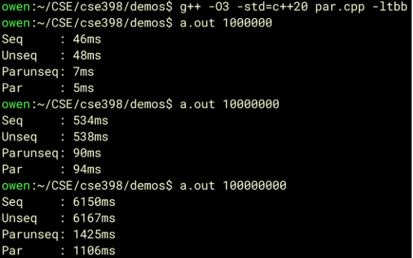

---

## Parallel Algorithm Design Principles

We design parallel algorithms by maximizing independent work, keeping total work close to the sequential baseline, minimizing the critical path, and reducing coordination overhead.

### Expose Independence

It is crucial to identify operations that can run concurrently without violating dependencies. Element wise transforms are naturally parallel because the iterations are independent. Prefix style recurrences are different since each step depends on the previous result, so useful parallelism usually requires restructuring the dependency pattern (e.g. tree-based reduction).

### Preserve Work Efficiency

A parallel algorithm should usually do the same asymptotic work as the best sequential algorithm. If the best sequential algorithm is $O(n)$, a useful parallel version should generally stay close to $O(n)$ work.

Reducing span is not enough if it causes a large increase in total work. Additional processors should spend most of their time on useful computation not task creation, synchronization, or redundant work.

### Minimize Span

Span is the longest dependency chain in a computation (the critical path). Reducing span increases the maximum possible speedup.

A common approach is to replace long chains with tree-shaped computations which reduces the span from $O(n)$ to $O(\log n)$ while preserving $O(n)$ work.

### Avoid Excessive Communication

Parallel algorithms often underperform because tasks coordinate too frequently. Coordination costs include:

- locks
- barriers
- atomic operations
- cache coherence traffic
- data movement between cores
- scheduling overhead

From a performance engineering perspective, algorithms scale best when they minimize communication and synchronization overhead while keeping enough parallel work available.

## Parallel Design Patterns

Parallel design patterns are common ways to organize computations so independent work is easy to identify. Each pattern exposes parallelism differently and has different performance bottlenecks.

---

### Map Pattern

The **map** pattern applies the same operation independently to each element in a dataset.

```cpp
void map_range(const std::vector<int>& in, std::vector<int>& out, std::size_t begin, std::size_t end) {
    for (std::size_t i = begin; i < end; ++i) {
        out[i] = in[i] * in[i];
    }
}

void map_parallel(const std::vector<int>& in, std::vector<int>& out) {
    const std::size_t n = in.size();
    const std::size_t mid = n / 2;

    std::thread t1(map_range, std::cref(in), std::ref(out), 0, mid);
    std::thread t2(map_range, std::cref(in), std::ref(out), mid, n);
    t1.join();
    t2.join();
}
```

This pattern is close to embarrassingly parallel because iterations are independent and each thread writes to a different output location.

Map pattern workloads are common in image processing, vector arithmetic, scientific kernels, and SIMD/GPU pipelines.

The main limit is often memory, not compute. If each element needs only a small amount of work, performance is usually capped by memory bandwidth. Contiguous access and balanced chunks help cache locality and make scaling more consistent.

---

### Stencil and Wavefront Computations

Some workloads are not purely element-wise. Sometimes each output depends on nearby values or earlier positions in a grid.

A **stencil** updates each point from a fixed neighborhood:

```cpp
for (int i = 1; i < n - 1; ++i) {
    out[i] = (in[i - 1] + in[i] + in[i + 1]) / 3;
}
```

All `out[i]` updates can happen at the same time because they only read from `in` and write to separate spots in `out`. Usually, you update all elements in parallel, wait for all threads to finish, then swap `in` and `out` for the next round.

This pattern is common in image filters, PDE solvers, and simulation kernels. Performance is often limited by memory, so cache locality and blocking/tiling usually matter more than arithmetic speed.

A **wavefront** has dependencies that move across a grid usually along diagonals:

```cpp
// fill in each diagonal of the dp grid one at a time. 
for (int d = 1; d <= rows + cols - 2; ++d) {
    int i_start = std::max(1, d - (cols - 1));
    int i_end = std::min(rows - 1, d);

    // all cells on diagonal d
    for (int i = i_start; i <= i_end; ++i) {
        int j = d - i;
        dp[i][j] = f(dp[i - 1][j], dp[i][j - 1]);
    }
}
```

In this pattern, cells along the same diagonal of the grid can all be computed at the same time because they don't depend on each other. After finishing one diagonal, you move on to the next.

This technique is common in problems like dynamic programming, sequence alignment, and some numerical algorithms. The amount of available parallel work changes with each diagonal depending on how many cells it contains.

Here, parallelism is shaped by how values depend on their neighbors or positions in the grid, not just by each cell being separate from the others.

---

### Reduction Pattern

A **reduction** combines many values into one using an associative operation.

Common reductions include sum, product, minimum, maximum, and logical AND/OR.

```cpp
int partial_sum(const std::vector<int>& a, int l, int r) {
    int s = 0;

    for (int i = l; i < r; ++i) {
        s += a[i];
    }

    return s;
}
```

A simple parallel version splits the input, computes independent local sums, and combines them:

```cpp
int left = 0, right = 0;
std::thread t1([&] { left = partial_sum(a, 0, a.size() / 2); });
std::thread t2([&] { right = partial_sum(a, a.size() / 2, a.size()); });
t1.join();
t2.join();
int total = left + right;
```

Each thread reduces a different chunk independently, and the partial results are then merged (typically as a tree for many chunks). This keeps total work at $O(n)$ while reducing span from $O(n)$ in the sequential chain to $O(\log n)$ in the tree merge.

The combine operation should be associative. Integer addition, multiplication, min, and max satisfy this well. Floating-point addition is more subtle because rounding depends on operation order, so parallel and sequential results may differ slightly.

---

### Scan Pattern

A **scan** (prefix sum) computes running totals. Each output stores the reduction of all prior inputs up to that index.

```text
Input:  [2, 3, 7, 5]
Output: [2, 5, 12, 17]
```

The simple sequential scan has a lot of dependencies between steps:

```cpp
out[0] = in[0];

for (int i = 1; i < n; i++) {
    out[i] = out[i - 1] + in[i];
}
```

At first glance, this looks sequential because `out[i]` depends on `out[i-1]`. Parallel scan works in two phases:

- **Up-sweep:** compute partial sums and block totals.
- **Down-sweep:** convert those totals into offsets and apply them to each block.

Simple inclusive-scan example for `[2, 3, 7, 5]`:

```text
A = [2, 3]  B = [7, 5]
```

1) Split into blocks and scan each block locally:

```text
A local scan = [2, 5], totalA = 5
B local scan = [7, 12], totalB = 12
```

2) Compute one offset per block.
The offset for a block is the sum of all elements in earlier blocks.

```text
offsets = [0, totalA] = [0, 5]
```

3) Add each block's offset to its local scan:

```text
A + 0 => [2, 5]
B + 5 => [12, 17]
```

4) Concatenate block results:

```text
scan = [2, 5, 12, 17]
```

This keeps the same result as the sequential scan, but exposes much more parallel work.

Scan is used in stream compaction, radix sort, GPU kernels, and filtering. The main idea is that a loop that looks sequential can still be parallelized by reorganizing dependencies.

---

### Other Patterns Worth Noting

- **Pipeline:** split work into stages and overlap different items across stages. This improves throughput, but one item still moves through stages in order. Main risks are stage imbalance and buffering/backpressure.
- **Divide-and-conquer (strategy):** recursively split a problem, solve subproblems, and merge results (fork-join). This is more of a general strategy than a single pattern, and it often exposes strong parallelism. Performance still depends on granularity, load balance, and scheduler overhead.

These ideas complement map/reduction/scan and appear often in real systems.

## Parallel Quicksort Case Study

Quicksort is a useful case study because it connects divide-and-conquer structure with practical performance engineering. Each call chooses a pivot, partitions the range, and recursively sorts the left and right sides.

On average, quicksort does $O(n \log n)$ work and is often cache-friendly because partitioning is done in place.

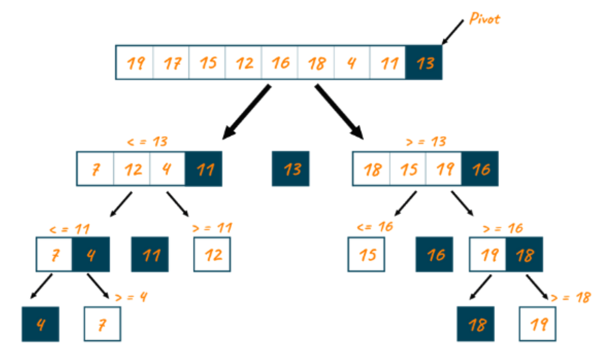

---

### Where Parallelism Comes From

After partitioning, the left and right subarrays become independent. The elements less than or equal to the pivot form the left subarray, the pivot itself is in the middle, and the elements greater than the pivot form the right subarray. 

The two recursive calls write to different memory ranges so they can run concurrently:

```cpp
quickSort(vec, low, pivot - 1);
quickSort(vec, pivot + 1, high);
```

The sequential algorithm already contains this structure; it just executes one branch after the other. Parallel quicksort exposes this recursion tree as a task DAG.

---

### Simple Parallel Quicksort Implementation

```cpp
int cutoff = 50000;

void quickSortParallel(vector<int>& vec, int low, int high) {
    if (low < high) {
        int pivot = partition(vec, low, high);

        if (high - low + 1 > cutoff) {
            std::thread t_low([&vec, low, pivot]() {
                quickSortParallel(vec, low, pivot - 1);
            });

            std::thread t_high([&vec, high, pivot]() {
                quickSortParallel(vec, pivot + 1, high);
            });

            t_low.join();
            t_high.join();
        } else {
            quickSort(vec, low, pivot - 1);
            quickSort(vec, pivot + 1, high);
        }
    }
}
```

The cutoff is important. Without it, recursion may create too many small tasks, and thread overhead can dominate sorting work.

---

### Work/Span Intuition

Parallelizing the recursive calls does not change the average work much:

$T_1 = O(n \log n)$

Span depends heavily on recursion tree shape. Balanced pivots expose more parallelism, while bad pivots create long dependency chains.

Partition is also a bottleneck since each recursive call must partition before it can expose more independent subproblems.

---

### Pivot Quality and Load Balance

Pivot choice controls the shape of the recursion tree. A good pivot creates roughly balanced partitions such as 50% / 50%. A bad pivot may create highly skewed partitions such as 1% / 99%.

Balanced pivots expose parallel work at each level. Skewed pivots create long dependency chains leaving cores idle. Using pivot seletion such as randomized pivots or median of three can improve balance.

#### Granularity Control

The cutoff controls task size.

- too small: too many tasks and high scheduling/thread overhead
- too large: not enough parallelism and underutilized cores

The best cutoff is workload and hardware dependent, so it should be tuned empirically.

#### Thread Management

Using raw `std::thread` is fine for simple demos, but creating a new thread for every recursive call is inefficient and can create too many threads.

Libraries like TBB or Cilk use thread pools and smart task scheduling to avoid this problem and balance the work better which we will discuss later.

---

### Parallelizing Partition

In this implementation, partitioning is sequential. A more advanced approach can parallelize partition using the scan pattern discussed earlier:

1. For each element, mark whether it should go to the left side or right side .
2. Run prefix sums over those marks to compute the exact write index for each element on each side.
3. Scatter elements into a temporary output array using those indices and then copy back.

This exposes more parallelism, but usually requires extra memory and more data movement. Sequential partition is simpler, in-place, and often more cache-friendly, while parallel partition can scale better but adds complexity and memory traffic.

In practice, the recursive parallelism in quicksort is easy to express once partitioning is done because the left and right subproblems are independent. However, real speedup still depends on pivot quality, task granularity, partition cost, memory locality, and the runtime scheduler.

---
## Counting Frequencies Case Study

Given an array `data` of length `n` with values in `[0, k-1]`, compute a count array `count` of length `k` where `count[b]` is how often value `b` appears.

This looks embarrassingly parallel over the input, but threads still share the same output bins. That shared output creates both correctness and performance issues.

The sequential version is simple:

```cpp
void count_sequential(const vector<int>& data, vector<int>& count) {
    for (int x : data) {
        count[x]++;
    }
}
```

Here, `data[i]` gives the bin index, and `count[x]` stores how many times value `x` appears. This pattern appears in image processing, telemetry aggregation, and database analytics.

The challenge is that each input element can be processed independently, but many elements may update the same output bin.

---

### Naive Parallelization

A first attempt is to split the input across threads:

```cpp
void count_naive_parallel(const vector<int>& data, vector<int>& count) {
    int n = data.size();
    vector<std::thread> threads;

    for (int t = 0; t < NUM_THREADS; t++) {
        int start = (t * n) / NUM_THREADS;
        int end = ((t + 1) * n) / NUM_THREADS;

        threads.push_back(std::thread([&, start, end]() {
            for (int i = start; i < end; i++) {
                count[data[i]]++;  // data race
            }
        }));
    }

    for (auto& t : threads) {
        t.join();
    }
}
```

This is incorrect because multiple threads may update the same counter at the same time. The operation:

```cpp
count[data[i]]++;
```

causes a data race, so some updates are lost and the counts can be wrong. The problem is that threads share the same output bins.

---

### Atomic Version

One correctness fix is to use atomic counters:

```cpp
void count_atomic(const vector<int>& data, vector<std::atomic<int>>& count) {
    int n = data.size();
    vector<std::thread> threads;

    for (int t = 0; t < NUM_THREADS; t++) {
        int start = (t * n) / NUM_THREADS;
        int end = ((t + 1) * n) / NUM_THREADS;

        threads.push_back(std::thread([&, start, end]() {
            for (int i = start; i < end; i++) {
                count[data[i]]++;
            }
        }));
    }

    for (auto& t : threads) {
        t.join();
    }
}
```

This version is correct, but it often performs poorly. Atomics prevent lost updates, but they still force coordination when many threads update the same bins. If the distribution is skewed or the number of bins is small, many threads repeatedly contend for the same output location. The program can become limited by synchronization and cache coherence traffic rather than useful counting work.

The important lesson is that correct synchronization does not guarantee scalable performance.

---

### Thread-Local Counting

A better approach is to avoid shared writes during the main counting loop. Each thread builds its own private output vector, and the local vectors are merged afterward.

```cpp
void count_thread_local(const vector<int>& data, vector<int>& count) {
    int n = data.size();
    int k = count.size();

    vector<vector<int>> local(NUM_THREADS, vector<int>(k, 0));
    vector<std::thread> threads;

    for (int t = 0; t < NUM_THREADS; t++) {
        int start = (t * n) / NUM_THREADS;
        int end = ((t + 1) * n) / NUM_THREADS;

        threads.push_back(std::thread([&, t, start, end]() {
            for (int i = start; i < end; i++) {
                local[t][data[i]]++;
            }
        }));
    }

    for (auto& t : threads) {
        t.join();
    }

    for (int b = 0; b < k; b++) {
        count[b] = 0;
        for (int t = 0; t < NUM_THREADS; t++) {
            count[b] += local[t][b];
        }
    }
}
```

This technique is called **privatization**.

Instead of all threads writing to one shared count array, each thread writes to its own local count array. The local rows are then reduced into the final `count` array. This is essentially a reduction pattern since we are reducing across threads into one final result.

The thread-local version removes shared writes from the loop, so contention is much lower than the atomic version. Counting remains $O(n)$, and the merge is $O(kp)$ for `k` bins and `p` threads. In practice, local accumulation plus merge is usually a strong baseline for scalable frequency counting.

## Structured Parallelism

Structured parallelism is a way of writing parallel programs where the task structure is explicit. You fork work into subtasks and join at synchronization points. In other words, parallel control flow is part of the program structure and not scattered across lower level thread operations.

Compared with manual threading, this is easier to reason about because thread creation, synchronization, and load balancing are mostly handled by the runtime instead of handwritten coordination code. That reduces race-prone complexity and makes both correctness and scalability (work/span behavior) easier to analyze.

Frameworks like TBB and Cilk follow this model which makes parallel programs simpler, more scalable, and easier to maintain.


## TBB Overview

TBB (Threading Building Blocks) is a structured parallelism framework created by IBM. It creates, synchronizes, and destroys graphs of dependent **tasks** according to high-level paradigms. This means that we no longer have to work with individual threads anymore, we can instead create tasks that are inherently parallel and allow TBB to take care of the actual execution. Apart from the simplicity this brings from a coding perspective, it is also incredibly beneficial because it allows us to take advantage of TBB's work stealing scheduler and load balancing abilities. If one thread manages to finish its work before the others, which could occur for a variety of reasons, instead of just sitting idel it will take tasks from another thread that has not yet finished.

Below we have a very simple example of how coding with TBB works. It is a simple for loop that will compute a value for each element of an array. The two main parts that differ from normal C++ are the `tbb::parallel_for` and `tbb:blocked_range`. `parallel_for` just asks TBB to parallelize the inner for loop that we pass as a lambda function, but the `blocked_range` is more interesting. In this context, it is essentially just how we can specify the start and end indices of the for loop. However as the blocked keyword implies, it breaks this iteration space into subspaces for each processor, which we can manually change to a point using grainsize (the amount of elements that are in each chunk). The default grainsize is 1 and this generally works very well, but if you want to change this behavior manually you can specify it in the range.

```
tbb::parallel_for(
    tbb::blocked_range<int>(0, n),
    [&](const tbb::blocked_range<int>& r) {
        for (int i = r.begin(); i != r.end(); ++i)
            y[i] += a * x[i];
    }
);

```
---

### Task Scheduler Internals

Although we are not manually specifying threads anymore, they still exist within TBB, but TBB will just give them tasks to complete without us having to do so manually. Each internal worker thread is comprised of a few parts, the thread itself, as well as a local deque (double ended queue). This way, it can push/pop tasks from the bottom  of its own queue and steal from the top of other queues.

#### Why Have LIFO and FIFO

##### LIFO (Last In First Out)

Oftentimes, when going through tasks, a thread may create another, related task. By taking from the bottom of the deque, we take the tasks that are hotter in the cache. This gives use better cache locality with future tasks, allowing them to be completed quicker. Additionally, if it can be completed, tasks depending on it can continue executing sooner.

##### FIFO (First In First Out)

In general, we want easy, atomic utilization of the deque by both the owner thread and the thread that is stealing a task. Since we have already decided that we want to take from the bottom of one's own stack, this leaves the top of the stack as generally unutilized so other threads can steal from it without creating unnecessary contention.

### Partitioners

---

When deciding how to partition the tasks, we need to balance load, overhead of task creation, cache locality, and steal frequency. There are a few different partitioners available in TBB, however we will focus mainly on `auto_partitioner` and `affinity_partitioner` as there are very, very few times when the others should be used, they are mainly for testing. Even within these two, `auto_partitioner` is what should be used the vast majority of the time. This goes along with the general theme of structured parallelism and TBB, **let the framework do the work for you**. It is possible that there will be specific instances where you know something about your code or workload that will allow you to make decisions that will outperform the framework, but in general it is easier and better to let TBB make the low-level decisions. One of the examples where this is not the case is with `affinity_partitioner`. We can specify this when we are doing repeated tasks that fit in the cache. It optimizes for data locality by reusing the same core for the same data across iterations.

```
for(int iter = 0; iter < 100; ++iter){
    parallel_for(range, body, affinity);
}
```

With the above code, we can see that it is computing tasks over and over again, so we may see some benefit by using the `affinity_partioner`. 

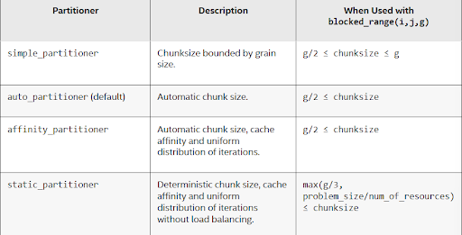
Table describing all partioners available with TBB


### Parallel Reduce

---

Similar to the `parallel_for` example we saw earlier, TBB also provides an easy mechanism to use for the common reduce pattern. Although execution order is not deterministic, the tasks that occur in the reduce have to be **associative**, not necessarily commutative. This is important because it allows for some tasks that may not initially seem to be parallelizeable in this way to be. For instance, string concatenation can be reduced using `parallel_reduce` and it will always come out with the same result as the sequential iteration would have.

Here, we can see an example of how `parallel_reduce` actually runs internally with TBB.

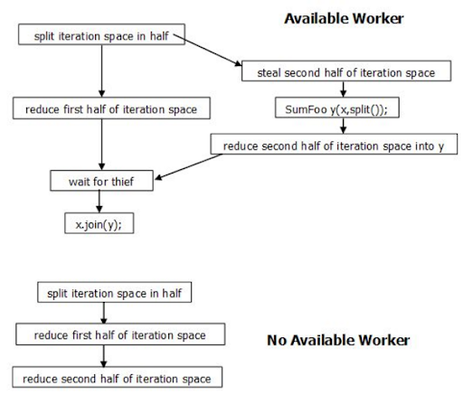

#### Code Example

In the following code, we can see how TBB allows us to easily compute operations such as sums of large arrays in parallel.  It is very similar to `parallel_for` with the exception of the needed identity value that we start with. In the case of  integer summations, this will be 0, for integer products it will be 1, and for other operations with objects or other data types ti will be wahtever fits with your scenario. 

```
#include <tbb/parallel_reduce.h>
#include <tbb/blocked_range.h>
#include <vector>
#include <iostream>

int main() {
    std::vector<int> data(1000000, 3);

    int sum = tbb::parallel_reduce(
        tbb::blocked_range<size_t>(0, data.size()),
        0,  // identity value
        [&](const tbb::blocked_range<size_t>& r, int local_sum) {
            for (size_t i = r.begin(); i != r.end(); ++i)
                local_sum += data[i];
            return local_sum;
        },
        std::plus<>()
    );

    std::cout << "Sum = " << sum << "\n";
}

```

### Parallel Pipeline

---

TBB also supports the utilization of pipelines, which are made up of various stages, not all of which need to be parallel. It can have `parallel` stages, `serial_in_order` stages, and/or `serial_out_of_order` stages. Any stage designated as `serial_in_of_order` will complete in the same order as other `serial_in_order` stages, while `serial_out_of_order` can execute in an arbitrary order. Within a pipeline, you can specify the maximum amount of elements you wish to have in flight at a time, and the pipeline will have a bias towards completing old items before tackling new ones. Each thread will also carry an item as many stages as possible in order to maximize cache locality. Rather than repeatedly having to bring in and kick items out of the cache, it will continue to utilize the same item, keeping it hot in the cache, until it no longer can.


#### Code Example

Below we can see an example of a `parallel_pipeline`, made up of both serial and parallel stages.

```
float RootMeanSquare( float* first, float* last ) {
    float sum=0;
    parallel_pipeline( /*max_number_of_live_token=*/16,
        make_filter<void,float*>(
            filter_mode::serial_in_order,
            [&](flow_control& fc)-> float*{
                if( first<last ) {
                    return first++;
                } else {
                    fc.stop();
                    return nullptr;
                }
            }
        ) &
        make_filter<float*,float>(
            filter_mode::parallel,
            [](float* p){return (*p)*(*p);}
        ) &
        make_filter<float,void>(
            filter_mode::serial_in_order,
            [&](float x) {sum+=x;}
        )
    );
    return sqrt(sum);
}
```

### Concurrency-Safe Structures & Memory

---

TBB also provides a variety of concurrent data structures for you to use

- **Concurrent Queue**
  - Multiple threads can safely access the queue
  - `push()` blocks if the queue is full
  - `pop()` blocks if the queue is empty

- **Concurrent Vector**
  - Supports concurrent `push_back`, `grow_by`, and element access
  - Clearing or destroying the vector is **not** guaranteed to be thread-safe

- **Other Concurrent Structures**
  - `concurrent_priority_queue`
  - `concurrent_hash_map`
  - `concurrent_unordered_map`
  - `concurrent_unordered_set`
  - `concurrent_map`
  - `concurrent_set`


### Memory Allocation

Although now provided by most modern systems, it can still be interesting to think about how we need to allocate memory with different threads. If we are all just using one pool with global locks and a global free list, we will end up with essentially serialized allocation paths, lock contention, and a collapse of scalability.

Instead, TBB and modern systems use per-thread heaps adn thread-local free lists and caches. This allows threads to immediately allocate memory on their own predesignated space without having to contend with other threads. In the case that we have allocated too much data and we no longer have sufficient room in our own heap, the threads will fall back to the global pool where necessary in order to ensure that the memory still gets allocated for the thread.


### Parallel Invoke / Fork-Join

---

Although we are generally working with tasks in TBB, there are some cases where we still want to have the fork-join functionality. In these cases, we can use `parallel_invoke` to model the same functionality while still offloading thread management to TBB. It is a blocking function, just like `join`, and allows us to just list the tasks that we want to run and it will allocate them to threads and not continue until all have finished. We can list as many as we want, and TBB will allocate them to threads as available.


#### Quick Sort with TBB

Below is a siple mechanism to use `parallel_invoke` to write quickSort with TBB. As you can see it lets us spawn in tasks recursively and it will then block until all tasks finish.

```
void quickSortTBB(vector<int>& vec, int low, int high) {
  if (low < high) {
    int pivot = partition(vec, low, high);
    int size = high - low + 1;
    if (size > cutoff) {
      tbb::parallel_invoke(
        [&] { quickSortTBB(vec, low, pivot - 1); },
        [&] { quickSortTBB(vec, pivot + 1, high); }
      );
    } else {
      quickSort(vec, low, pivot - 1);
      quickSort(vec, pivot + 1, high);
    }
  }
}

```


However, when it still ends up falling short of the normal standard sort implementation wehn used with the parallel execution option.

| Method            | Time (ms) |
|------------------|----------|
| Sequential        | 50.3053  |
| Thread parallel   | 10.5215  |
| TBB quicksort     | 9.94562  |
| TBB parallel_sort | 9.07249  |
| Standard Sort     | 4.66093  |

---

## Cilk
An alternative to TBB is the Cilk programming language. Cilk provides abstractions that allow for parallel computations to run on multicore systems. It is the programmer's responsibility to express logical parallelism, and the Cilk compiler will produce the optimal parallel code, and the Cilk runtime will execute the code and perform load balancing and scheduling.

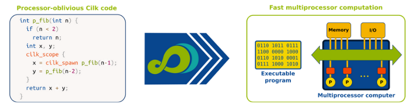

Cilk decomposes programs into a collection of strands and knots. Strands are sections of serial instructions, and knots are points where three or more strands meet. A simple Cilk program is shown in the figure below, with the graph above representing the source code below. This representation corresponds with the DAG representation of a program, with Cilk providing a tool that can calculate the work and span of a program.

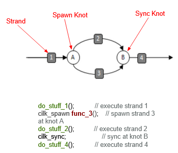


### Accelerating Quicksort with Cilk

Using a simple quick sort implementation, Cilk primitives can be used to trivially parallelize the program. The full benchmark configuration can be found in the Cilk folder, with the Cilk version in quick_cilk.cpp, and the serial version in quick_serial.cpp. After modifying the serial version with the code below, the code sorted 100000000 integers nearly 6 times faster than the sequential version, achieving a CPU utilization of 5.983 according to perf (when executed on a system with 16 logical CPUs).

```
template <typename T>
void sample_qsort(T* begin, T* end){
…
cilk_scope {
      cilk_spawn sample_qsort(begin, middle);
      sample_qsort(++middle, ++end);  // exclude pivot and restore end
    }
}
```

### Other Cilk Utilities 

This section provides a brief overview of some of the other features that Cilk offers developers. Cilkscan is a utility that can detect race conditions in code. This tool integrates several sanitization tools, such as Google Sanitize. Cilk provides reducers that can be used to store a computation's result in a single location. These reducers require that the operation is associative in order for the result to be deterministic, and the “views” are managed by the Cilk runtime, which ensures that each strand has its own view. Lastly, Cilk also provides deterministic pseudo-random number generators. Standard PRNGs can produce non-deterministic results across runs of a parallel application, which can make debugging a parallel application difficult. By using Cilk’s built-in PRNG, the output of a parallel program produces repeatable results regardless of the task scheduling.


### Cilk vs TBB

The performance between Cilk and TBB is comparable for many parallel workloads, as found in
[this comparison](https://scispace.com/pdf/comparison-of-three-popular-parallel-programming-models-on-35qlabguav.pdf) of different parallel frameworks. The syntax that Cilk adds to C/C++ is close to the simplicity of the compiler flags utilized by OMP, and is less verbose than TBB. One of the major drawbacks of Cilk is that it requires a specialized compiler. As it is technically a language rather than a C++ library, compiler support is required, which means that TBB can be deployed in a wider range of projects and applications.
